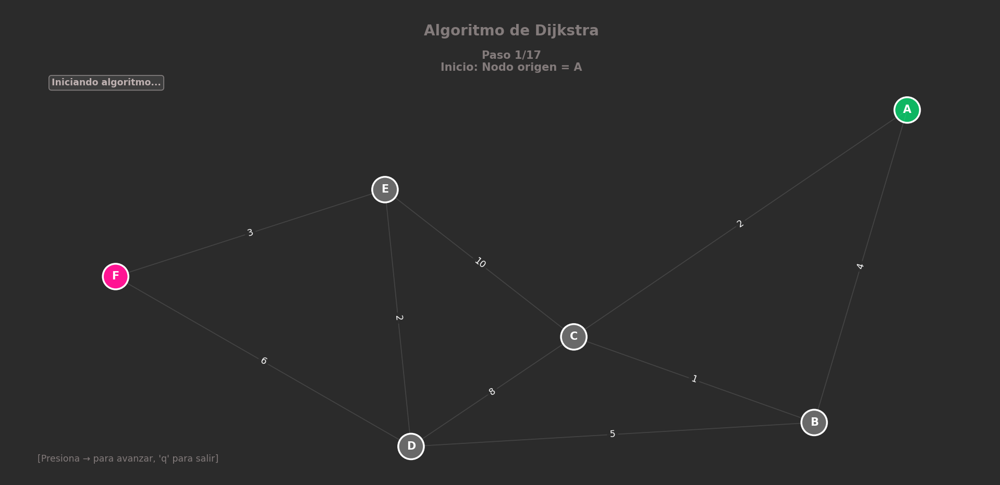
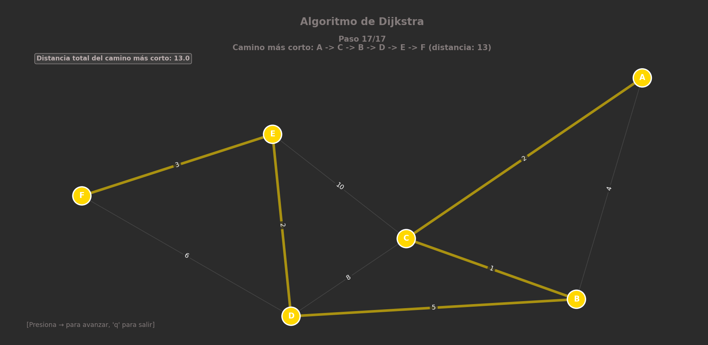

# Práctica 3: Algoritmo de Dijkstra (IA)

Este repositorio contiene la implementación en Python del **Algoritmo de Dijkstra**, desarrollado como parte de la materia de Inteligencia Artificial. El proyecto incluye el cálculo de rutas óptimas y una visualización gráfica del proceso sobre un grafo.

## ¿Qué es el Algoritmo de Dijkstra?

El algoritmo de Dijkstra (creado por Edsger W. Dijkstra en 1956) es uno de los algoritmos más famosos en ciencias de la computación. Se utiliza para encontrar el **camino más corto** (o el de menor costo) entre un nodo origen y todos los demás nodos en un grafo con pesos positivos.

### ¿Cómo funciona?
1.  **Inicialización:** Asigna una distancia de 0 al nodo origen y de infinito ($\infty$) a todos los demás.
2.  **Exploración:** Visita el nodo no visitado con la menor distancia conocida actual.
3.  **Relajación:** Revisa sus vecinos. Si encuentra un camino hacia un vecino que es más corto que el que conocía anteriormente, actualiza esa distancia.
4.  **Repetición:** Repite el proceso hasta visitar todos los nodos o llegar al destino.

Es la base de muchas aplicaciones modernas, como los sistemas de navegación GPS (Google Maps, Waze) y los protocolos de enrutamiento de internet (OSPF).

---

## Sobre el Código

Este script de Python implementa la lógica del algoritmo y la combina con una interfaz gráfica para facilitar su comprensión.

**Características principales:**
* **Definición de Grafos:** Permite establecer nodos (vértices) y conexiones (aristas) con pesos específicos (costos).
* **Cálculo de Ruta:** Determina la secuencia óptima de nodos para ir de un punto A a un punto B minimizando el costo total.
* **Visualización:** Muestra gráficamente el grafo, resaltando los nodos y las conexiones, así como el camino resultante.

---

## Visualización y Resultados

En esta sección se muestra el funcionamiento del algoritmo mediante la interfaz gráfica implementada.

### 1. Grafo Inicial
> *Aquí se muestra el grafo completo con sus nodos y pesos antes de ejecutar la búsqueda.*



### 2. Camino Más Corto Encontrado
> *Visualización de la ruta óptima calculada por el algoritmo (resaltada).*



---

## Cómo ejecutar

Para correr este proyecto en tu máquina local, asegúrate de tener Python instalado y las librerías necesarias (como `networkx` y `matplotlib`).

1.  Clona el repositorio:
    ```bash
    git clone [https://github.com/AlanDorantesVerdin/IA_P3_AlgoritmoDijkstra.git]
    ```
2.  Navega a la carpeta:
    ```bash
    cd IA_P3_AlgoritmoDijkstra
    ```
3.  Ejecuta el script principal:
    ```bash
    python main.py
    # O el nombre que tenga tu archivo principal
    ```

---

## Autor

* **Alan Dorantes Verdin** - [GitHub Profile](https://github.com/AlanDorantesVerdin)